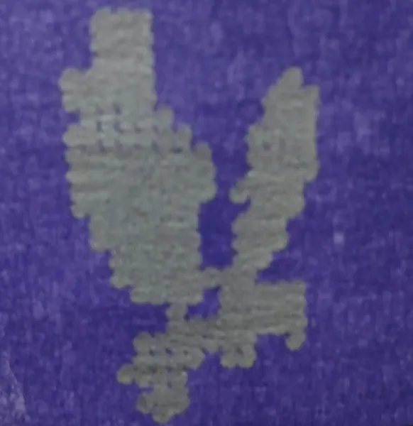
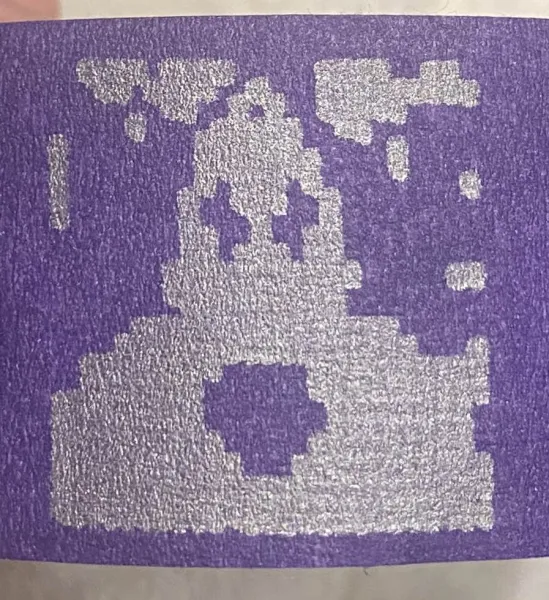
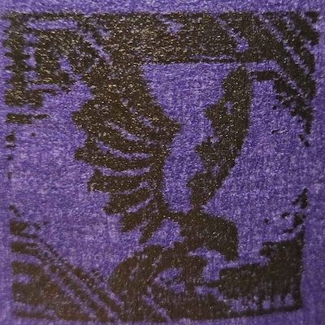

# LabelMakerCustomImage

<!--
<p align="center">
  
  
</p>
-->

Example 100x100 (Drafting Pen)                  |  Example 25x25
:-------------------------:|:-------------------------:
  |  

---

This project is a hack of the CrunchLabs Hack Pack Box #3: Label Maker. It processes a custom image to generate Arduino code that draws your chosen image on the HackPack Label Maker. Supported image formats include `.png`, `.jpg`, and `.jpeg`.


## Features

- Converts an image into a binary bitmap.
- Displays the processed bitmap using matplotlib.
- Generates code for the Label Maker.
- Allows customization of drawing parameters.

## Prerequisites

- **Python 3** (Make sure Python is installed on your system)

### Installation 

This project requires the following Python libraries:
- numpy
- pillow
- matplotlib
- argparse

It is always recommended to use a virtual environment for Python projects.

You can install the required libraries using pip:

```bash
pip install numpy pillow matplotlib argparse
```

Or you can install them using the `requirements.txt` file:

```bash
pip install -r requirements.txt
```

## Usage

Download the `main.py` file from this repository. Open a terminal in the directory containing `main.py` and run the command below. All parameters are optional; if not provided, default values will be used.

```bash
python -m main --image_path path/to/your/image.jpg --draw_dark_pixels True --num_points_width 25 --num_steps_width 1350
```


### Command-Line Options

- `--image_path`  
  **Description:** Path to the image file (supported formats: .png, .jpg, .jpeg).  
  **Default:** `"images/heavy_falcon.jpeg"`

- `--draw_dark_pixels`  
  **Description:** Set to `True` to draw points for dark pixels, or `False` to draw points for light pixels.  
  **Default:** `True`

- `--num_points_width`  
  **Description:** The grid size used for processing. The image is processed into a grid of `num_points_width x num_points width` points.  
  **Default:** `25`

- `--num_steps_width`  
  **Description:** The overall drawing width in stepper motor steps.  
  **Default:** `1350`

  - `--threshold_factor`
    **Description:** The threshold factor used to determine if a pixel is dark or light relative to the image's average brightness.  The default value of 1.0 means that a pixel is considered dark if its brightness is above or below the average brightness of the image (depending on the value of --draw_dark_pixels).
    **Default:** `1.0`

After running the command, the program will process the image, display a plot of the generated bitmap, and output a code file (formatted as a C array) in your current directory. Follow the on-screen instructions, and then upload the generated code to your Arduino Nano using the Arduino IDE or CrunchLabs.


Using a higher `num_points_width` value will result in a more detailed image, but it will also require more time to draw, and may require a drafting pen instead of a marker.  Setting this to 100 draws up to 100x100=10,000 points in a tiny grid! The `num_steps_width` parameter determines the overall drawing width in stepper motor steps, where the default is good for the purple tape that the Label Maker ships with. The `draw_dark_pixels` parameter allows you to choose whether to draw dark or light pixels detected in the input image.

## Future Enhancements

- **AI Image Generation:** Include a function to generate images using AI.

Enjoy customizing your Label Maker with your own images!